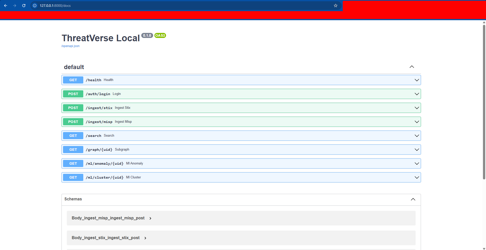
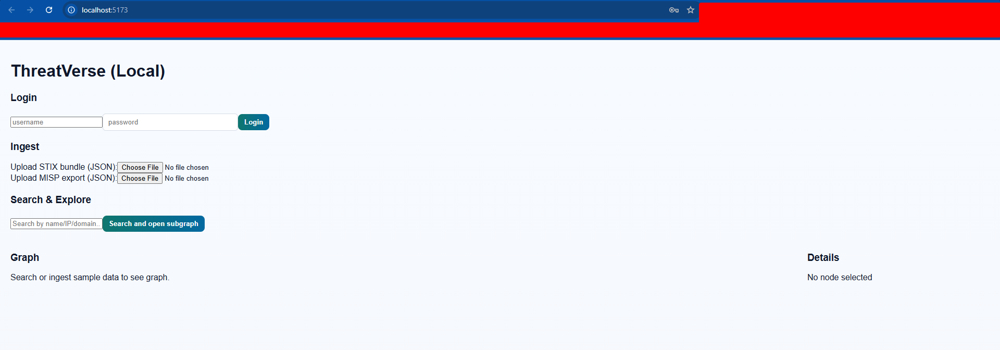

# ThreatVerse - Local (no-Docker) edition
- This repository provides a locally-runnable version of ThreatVerse - which is a threat intelligence knowledge graph that ingests STIX and MISP exports,
stores them in Neo4j (or a local in-memory fallback), and visualizes them
in a React web UI.

## Quickstart
- VSCode structure:


### 1) Backend
- Python 3.9+
- `wsl`
- `cd backend`
- `pip install -r requirements.txt`
- `python3 -m uvicorn app:app --reload --port 8000`


- Copy `.env.example` -> `.env` and edit (set NEO4J_* if you have Neo4j)
- Run: `uvicorn app:app --reload --port 8000`
- Visit: `http://localhost:8000/docs` for API docs:


- If you do NOT have Neo4j, leave `NEO4J_URI` blank. The app then uses an in-memory graph (NetworkX). Data will be lost when the server stops.

### 2) Frontend
- Node 18+, npm
- `wsl`
- `cd frontend`
- `npm install`
- `npm run dev`


- Open the URL printed by Vite (typically http://localhost:5173)


### 3) Login credentials
- Default user from `.env.example`: `admin / ChangeMe123`

### 4) Ingest sample data
- Use the web UI to upload `backend/sample_data/sample_stix.json` and `sample_misp.json`
- Search for "Zeus" or "APT28" and visualize the graph.

## Extending to TAXII / MISP API
- The backend includes file upload ingestion only.
- To add live TAXII or PyMISP integration, add connectors that fetch from remote endpoints (store API keys in .env).
- STIX objects are ingested by `ingest_stix.py`, MISP exports by `ingest_misp.py`.

## ML features
- `/ml/anomaly/{uid}` returns degree centrality scores for nodes in subgraph.
- `/ml/cluster/{uid}` returns DBSCAN cluster labels on simple features (degree, centrality).

## Notes and next steps
- This repo is intended as a working local prototype and reference implementation.
- For production: add persistent Neo4j, proper RBAC, rate-limiting, HTTPS, background job queue, connectors for TAXII & MISP, and stronger input validation.

## Contributions
- Welcome to the ```ThreatVerse``` repo - glad that you are here. Explore the code, run it locally, and contribute bug reports, feature ideas, or pull requests to help improve it <3
